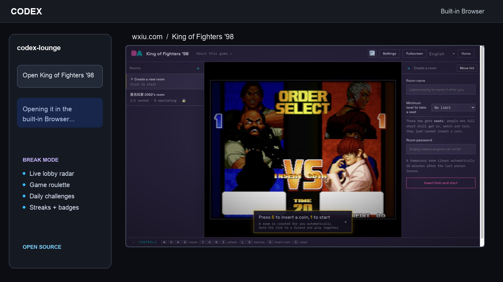

<p align="center">
  <strong>简体中文</strong> · <a href="README.en.md">English</a>
</p>

# Codex Lounge

> 写代码、看节目、找灵感、休息一下——不用离开 Codex。

Codex Lounge 是一个开源 Codex 插件。它把内嵌 Browser 变成你的“代码客厅”：帮你进入专注状态、学习新技术、从 YouTube 和 X 获得灵感、完成发布收尾，也能开启有时间上限的游戏休息。



## 五种模式

| 模式 | 适合什么时候 | Codex Lounge 会做什么 |
| --- | --- | --- |
| `deep-focus` | 想专心完成一件事 | 确定一个可验证的结果，尽量不打开媒体 |
| `learn-and-build` | 边学边做 | 找一个与当前项目相关的视频，然后立即实现 |
| `explore` | 需要技术或产品灵感 | 生成不超过 5 条的 YouTube + X 灵感雷达 |
| `ship` | 准备提交或发布 | 检查 diff、运行测试、整理文档和 Release Notes |
| `break` | 需要短暂换换脑子 | 打开 YouTube、X、免费扑克或街机，并保持休息有时间边界 |

## 核心能力

- 打开 YouTube 视频、节目、频道、播放列表和专注音乐。
- 查看 X/Twitter 首页、个人主页、自己的帖子、书签和列表。
- 根据当前仓库生成简短、可执行的灵感雷达。
- 本地记录会话目标、模式、时长、链接、笔记和完成结果。
- 检查测试、diff 和文档，准备 GitHub Release 与宣传草稿。
- 开启免费德州扑克、wxiu 街机雷达、轮盘、挑战、成就和好友房。

## 试试这样说

```text
开始一个 45 分钟的 Vibe Coding 会话，目标是完成登录页
根据当前仓库找一个值得看的 YouTube 教程，然后陪我实现
看看 X 上最近有哪些和这个技术栈相关的高质量帖子
保存这个视频到本次 coding 会话
帮我收尾：跑测试、总结 diff、写 Release Notes
开一个 15 分钟的免费德州扑克 Break Mode，不要真钱
转一下街机轮盘：两个人，20 分钟，想轻松玩
```

## 安装

需要支持插件的 Codex/ChatGPT，并安装启用 OpenAI 官方 Browser 插件。

```bash
codex plugin marketplace add leiMizzou/codex-lounge --ref main
codex plugin add codex-lounge@codex-lounge
```

安装后新建一个 Codex 任务。首次访问 YouTube、X、扑克网站或 wxiu.com 时，可能需要确认站点权限或由你完成登录。

## 免费扑克与安全边界

Codex Lounge 只使用明确标注为免费或 play-money、没有现金价值和真实奖品的候选站点，并在打开前重新检查页面说明。

插件不会协助真钱、现金、加密货币、抽奖或有奖扑克，也不会处理充值、提现、购买筹码、转移价值、绕过地区限制或年龄检查。登录、发帖、发送邀请、提交、推送和发布都不会仅因为生成了草稿就自动执行。

## 本地数据

- Vibe Coding 会话：`~/.codex/codex-lounge/sessions.json`
- 街机挑战与成就：`~/.codex/codex-lounge/arcade-progress.json`

只保存你明确要求记录的会话元数据。不保存登录凭据、Cookie、私信、完整 Feed、源码、Browser 历史或邀请链接；本地工具也不提供 reset/delete 命令。

## 开发与验证

```bash
python3 scripts/validate.py
python3 -m unittest discover -s tests -v
```

仓库中包含 12 个 Skill、无第三方依赖的本地状态脚本，以及针对会话、街机记录和免费扑克边界的回归测试。

## License

插件源码与指令使用 [MIT License](LICENSE)。第三方网站、游戏、视频、帖子、名称、美术资源和商标不包含在本许可范围内。
